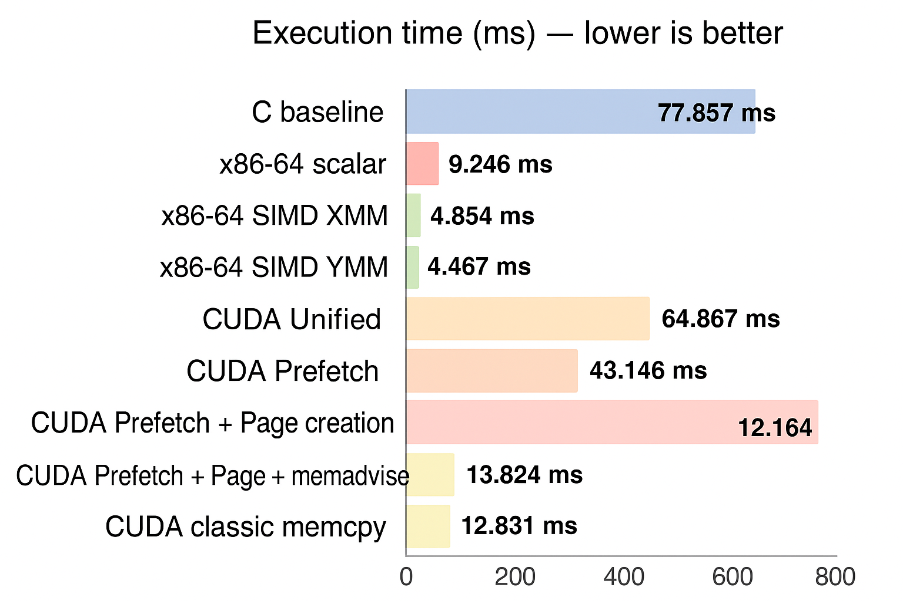
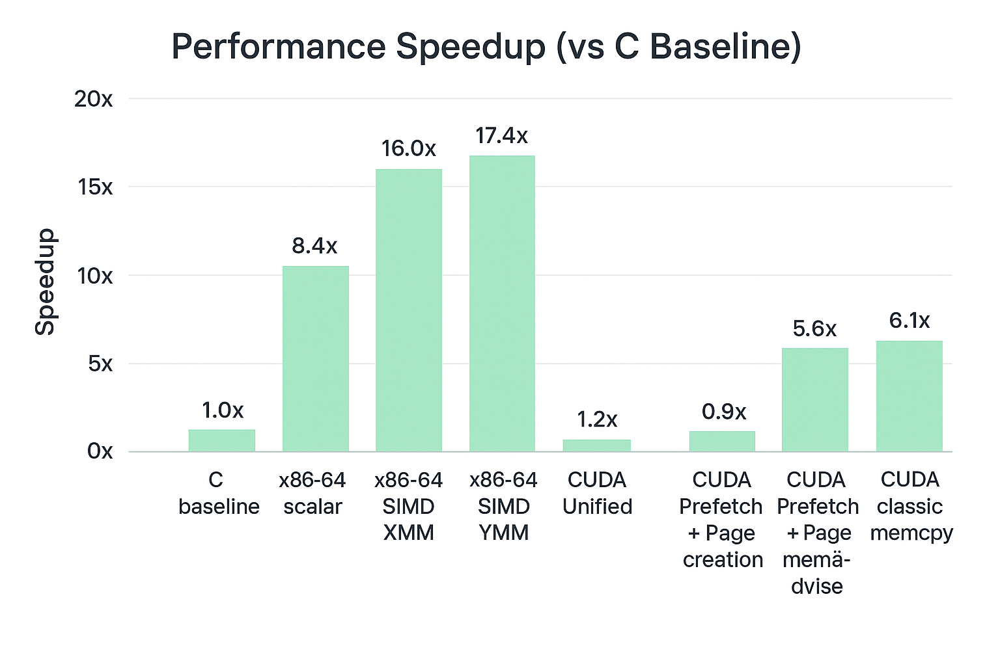

**Group members**
	- Manaois, Raidon
	- Ramos, Aebrahm Clyde P.
	- Reyes, Cyril Sam N

**Project specifications**
	- Task: Create a matrix vector product in different kernels and perform comparative analysis. 

**AI usage declaration**
	- **NotebookLM**: Used for explaining the contents of the discovery series notebook, tutorial notebook, and cuda documentation. Served as a knowledgebase chatbot for all the files and provided flowchart for the ideas.
	- **Gemini**: Used for generating the Markdown formatting and layout of the ReadMe
	- **Grammarly**: Used for improving writing and correcting grammatical, spelling, and punctuation errors.

## i) Program output screenshots (correctness + timing)

- screenshots/
	- output_c.png                — C baseline output + time
	- output_x86_scalar.png       — x86-64 scalar
	- output_xmm.png              — x86-64 SIMD XMM
	- output_ymm.png              — x86-64 SIMD YMM
	- simt/nvprof-var2.png        — CUDA Unified output
	- simt/nvprof-var3.png        — CUDA Prefetch output
	- simt/nvprof-var4.png        — CUDA Prefetch + page creation
	- simt/nvprof-var5.png        — CUDA Prefetch + page + memadvise
	- simt/nvprof-var6.png        — CUDA classic memcpy output
	- nsight/nsight-var2.png     — Nsight report: CUDA Unified
	- nsight/nsight-var3.png     — Nsight report: CUDA Prefetch
	- nsight/nsight-var4.png     — Nsight report: CUDA Page creation
	- nsight/nsight-var5.png     — Nsight report: CUDA MemAdvise
	- nsight/nsight-var6.png     — Nsight report: CUDA memcpy

\
C baseline — correctness passed (L2 error = 0), wall-clock time = 77.856500 ms

\
x86-64 scalar — correctness passed (L2 error = OK), wall-clock time = 9.245687 ms

\
x86-64 SIMD XMM — correctness passed (L2 error = OK), wall-clock time = 4.853967 ms

\
x86-64 SIMD YMM — correctness passed (L2 error = OK), wall-clock time = 4.466910 ms

\
CUDA Unified — correctness passed (L2 error = 0), wall-clock time = 64.86667 ms

\
CUDA Prefetch — correctness passed (L2 error = 0), wall-clock time = 43.14558 ms

\
CUDA Prefetch + Page creation — correctness passed (L2 error = 0), wall-clock time = 89.16437 ms

\
CUDA Prefetch + Page + memadvise — correctness passed (L2 error = 0), wall-clock time = 13.824438 ms

\
CUDA classic memcpy — correctness passed (L2 error = 0), wall-clock time = 12.831062 ms

## ii) nSight screenshots for CUDA variants

Nsight report — CUDA Unified

Nsight report — CUDA Prefetch

Nsight report — CUDA Page creation

Nsight report — CUDA MemAdvise

Nsight report — CUDA memcpy

## iii) Comparative execution-time table

| Platform / Variant | Measured time (ms) | Speedup vs C |
|---|---:|---:|
| C baseline | 77.856500 | 1.0000x |
| x86-64 scalar | 9.245687 | 8.4210x |
| x86-64 SIMD XMM | 4.853967 | 16.0398x |
| x86-64 SIMD YMM | 4.46691 | 17.4296x |
| CUDA Unified | 64.86667 | 1.2003x |
| CUDA Prefetch | 43.14558 | 1.8045x |
| CUDA Prefetch + Page creation | 89.16437 |0.8734x (slower than C) |
| CUDA Prefetch + Page + memadvise | 13.824438 |5.6318x|
| CUDA classic memcpy | 12.831062 |6.0678x |
| CUDA data init in kernel | ____ | ____ |

## iv) Analysis of results

*Provide concise, evidence-backed answers to the questions below and include any additional observations.*

The x86-64 SIMD YMM variant was the fastest overall at 4.46 ms and achieved the maximum speedup of 17.4296x. In contrast, the fastest GPU variant, CUDA classic memcpy, achieved only 6.0678x speedup. This difference indicates that for this matrix-vector product workload, the SIMD approach on the CPU is highly efficient because it avoids the high latency and limited bandwidth associated with data transfer to the GPU's memory.

The CUDA Unified Memory (UM) results highlight the importance of tuning:

- The CUDA Prefetch + Page creation variant was the slowest overall (89.16 ms, a 0.8734x speedup). This severe performance hit was primarily due to Page Thrashing, which resulted in a massive 71.6 ms Device-to-Host (D2H) transfer overhead.

- Adding memadvise solved the thrashing, reducing the time dramatically to 13.82 ms (5.6318x speedup)

### Guide questions:

**a) What overheads are included in the GPU execution time (up to the point data are transferred back for error checking)? Is it different for each CUDA variant?**
	- All of the variants includes several overheads like: host to device data transfer, device to host data transfer, kernel launch, and page migration. The CUDA Variant 4 with Prefetch and Page Creation exepmplifies this and is a good evidence, it shows page thrashing causing a bottleneck because "Communication overhead impacts parallel system performance" (Fiveable, n.d.). When Variant 4 is compared to the Classic Memcpy variant, the Classic memcpy variant is more efficient.

	-	Kernel Launch Overhead: The time taken by the CPU thread to invoke and queue the kernel on the GPU.
	
	-	Kernel Execution Time: The time spent by the Streaming Multiprocessors performing the actual matrix-vector multiplication.
	
	-	Data Transfer/Management Overheads:
		-	Classic memcpy (VAR6): Includes explicit, predictable cudaMemcpyHostToDevice (H2D) and cudaMemcpyDeviceToHost (D2H) transfer
			times, which happen sequentially before and after the kernel.
			
		-	Unified Memory (VAR2-VAR5): These variants replace explicit transfers with Page Migration Overheads. Data is moved on-demand
			via Page Faults when accessed by either the CPU or GPU.
			
		-	UM + Prefetch (VAR3/VAR5): Explicit cudaMemPrefetchAsync is used to hide some of the H2D migration cost by moving data
			asynchronously before the kernel starts, preventing on-demand page faults during execution.	
			
		-	UM + Thrashing (VAR4): This introduces severe, destructive overhead from Page Thrashing, where the CPU and GPU repeatedly
			request and migrate the same memory pages back and forth, consuming vast amounts of time (as seen in the 89 ms result). 
	
**b) How does block size affect execution time (observing various element counts and max blocks)? Which block size would you recommend and why?**

- cudaMallocManaged Time Decreases (64 to 1024): This initial time often includes the very first page faults and the initial setup of the UM system. As the block size increases (and therefore the total number of threads/blocks increases, up to the optimal point), the kernel is more effectively utilizing the GPU, and the initial time taken before the kernel launch might look better because more work is being done in parallel.
- H2D / D2H Time Increases at 1024
  -	While a block size of 1024 is the maximum allowed on most modern GPUs and generally leads to the fastest kernel execution time (because the GPU is fully saturated), it can also lead to increased data migration (H2D and D2H).
  -	A larger block size means the GPU threads are accessing memory frequently and potentially non-contiguously across different thread blocks. If the memory access patterns cause the data to "thrash" (constantly being swapped back and forth between CPU and GPU pages), the time spent migrating data (H2D/D2H) will spike dramatically, even if the kernel itself is technically running at max speed.

Data suggests that 1024 threads per block may be great for compute speed, but it causes the highest Unified Memory overhead (H2D/D2H migration). A slightly smaller size (like 512 or 256) might offer a better balance between fast kernel execution and minimized data transfer overhead, leading to the best overall wall-clock time.

**c) Is prefetching always recommended, or should CUDA manage memory? Give specific use cases where prefetching helps or hurts.**

- Prefetching is not always recommended. Relying on CUDA's automatic Unified Memory (UM) management is generally simpler and safer by default.
-  Prefetching is beneficial for large, sequential data access patterns (e.g., streaming data to the GPU). It enables the programmer to execute a single, efficient bulk transfer (cudaMemPrefetchAsync), which is faster than relying on the high latency of multiple, individual page faults (e.g., Prefetch reduced time from 64.86 text ms to 43.14 ms).
-  Prefetching hurts performance if used without the memadvise locality hint. In alternating CPU/GPU access scenarios, this can confuse the memory manager and lead to severe Page Thrashing, resulting in the worst-case time of 89.16 ms.

**d) Between SIMD and SIMT, which is faster for this workload? Give use cases where one model is preferable.**

- SIMD (x86-64) is significantly faster for this workload (4.46 ms) than the fastest SIMT/CUDA variant (12.83 ms).
- SIMD is preferable for small, simple, compute-intensive workloads where the cost of data movement to the GPU is the dominant bottleneck.
- SIMT is preferable for massively parallel, latency-tolerant workloads where the computation time is large enough to amortize the initial data transfer overhead, such as large-scale simulations.

## Visualizations

## v) Problems encountered, solutions, and notable methodology

- **Problems encountered:**
	- We encountered inconsisstency in the data initialization across the differnt CUDA variants which resulted to the inaccurate comparison of execution time. 

- **Solutions and reasoning:**
    - Our solution for thhe inconsistency of the data initailization is a single, unified deterministic data initializer executed before timing identifical for all variants. 

- **Unique methodology / AHA moments:**
    - SIMD vs. SIMT Crossover Point: The clearest AHA moment was the empirical result showing that SIMD (YMM) was significantly faster than all SIMT variants. This demonstrated that for the 4096 x 4096 matrix-vector problem, the overhead of data transfer and Unified Memory management dominated the total execution time, negating the GPU's massive theoretical computational advantage.
    - Grid-Stride Loop Implementation: The consistent use of the Grid-Stride Loop pattern in all CUDA kernels ensured that the code was scalable across various block and grid sizes, which is an essential best practice for robust parallel programming on the GPU.

## vi) SIMD vs SIMT — conceptual comparison and project-specific pros/cons

1. **Data vs Thread**
	- SIMD: Single Instruciton, Multiple Data, from its name deals with data parallel executions where a single thread issues vector instructions to operate on registers like the 256 bit YMM registers containing vectors. Since the programmer is repsponsible for putting the data in and out of the registers, it may be quite of complex especially for simple tasks.
	- SIMT: Single Instruction, Multiple Threads, from its name launches thousands of threads from a single conceptual thread with a scalar code. This model is easier to program as the programmer doesn't need to manually do data chunking and management of the data into warps.
2. **Latency vs Througput**
	- SIMD: Since SIMD lies in the cpu, the performance of SIMD's are optimized for latency not having much overhead and relying on contiguous data access. These data fits in the CPU's cache (Springer, 2019).
	- SIMT: Since SIMT lies within the GPU, it's more optimized for throuput since there are communication overhead to and from the device. "Shared memory can also be used to avoid uncoalesced memory accesses by loading and storing data in a coalesced pattern from global memory and then reordering it in shared memory." (Nvidia, n.d.; Springer, 2019)
### Project SPeicfic Analysis and Conclusion
- The conceptual difference between SIMD and SIMT is fundamentally one of scale versus overhead. Our results shows a clear example of the trade-off.
- SIMD, used via x86 AVX, achieves parallelism by applying a single instruction to multiple data elements within a single CPU core. This model has very low launch overhead and the fastest implementation (YMM) achieved an exceptional 4.467 ms.
- In contrast, SIMT achieves massive parallelism by running thousands of threads across numerous GPU cores. Although theoretically more powerful for compute-heavy tasks, the best performing SIMT variant (Classic memcpy) took 12.831 ms.
- Therefore, for this specific 4096 x 4096 matrix-vector multiplication, the SIMD model was empirically faster due to the high data transfer and memory management overheads (including cudaMemcpy time) that bottlenecked the CUDA variants. 
	
*Based from our findings, these are the preferable use cases for each:*
- SIMD is preferable for workloads where the data set fits in memory and the overhead of data transfer dominates computation time,
- while SIMT is preferable for large-scale, compute-bound problems where data transfer time is relatively small compared to the kernel execution time. 

# References
Fiveable. (n.d.). Challenges & opportunities — Parallel and distributed computing (Unit 1 study guide). Fiveable. https://fiveable.me/parallel-and-distributed-computing/unit-1/challenges-opportunities-parallel-computing/study-guide/y1mgJbjLL5Q3keYw

Nvidia. (n.d.). CUDA C++ Best Practices Guide. https://docs.nvidia.com/cuda/cuda-c-best-practices-guide/

Springer, M. (2019, July 10). Memory coalescing vs. vectorized memory access [Online forum post]. Stack Overflow. https://stackoverflow.com/questions/56966466/memory-coalescing-vs-vectorized-memory-access

Last updated: November 5, 2025
