## 0) Administrative

- Group members
	- Manaois, Raidon
	- Ramos, Aebrahm Clyde P.
	- Reyes, Chino
- Project specifications
	- Problem: 
    - other specs
- AI usage declaration
	- Gemini
        - Used for explaining the contents of the discovery series notebook, tutorial notebook, and cuda documentaiton
        - Used for generating the Markdown formatting and layout of the ReadMe

## i) Program output screenshots (correctness + timing)

- screenshots/
	- output_c.png                — C baseline output + time
	- output_x86_scalar.png       — x86-64 scalar
	- output_xmm.png              — x86-64 SIMD XMM
	- output_ymm.png              — x86-64 SIMD YMM
	- simt/nvprof-var2.png        — CUDA Unified output
	- simt/nvprof-var3.png        — CUDA Prefetch output
	- simt/nvprof-var4.png        — CUDA Prefetch + page creation
	- simt/nvprof-var5.png        — CUDA Prefetch + page + memadvise
	- simt/nvprof-var6.png        — CUDA classic memcpy output
	- nsight/nsight-var2.png     — Nsight report: CUDA Unified
	- nsight/nsight-var3.png     — Nsight report: CUDA Prefetch
	- nsight/nsight-var4.png     — Nsight report: CUDA Page creation
	- nsight/nsight-var5.png     — Nsight report: CUDA MemAdvise
	- nsight/nsight-var6.png     — Nsight report: CUDA memcpy

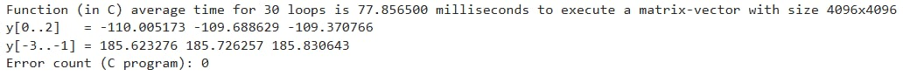

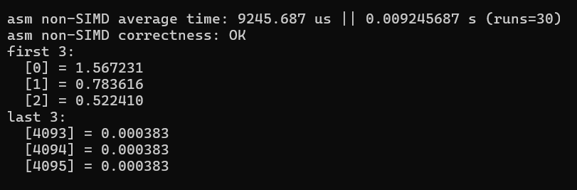

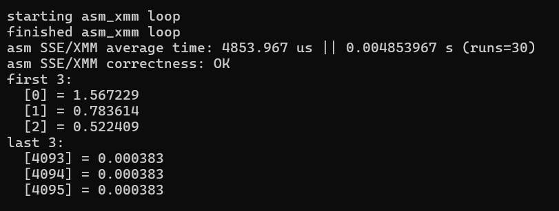

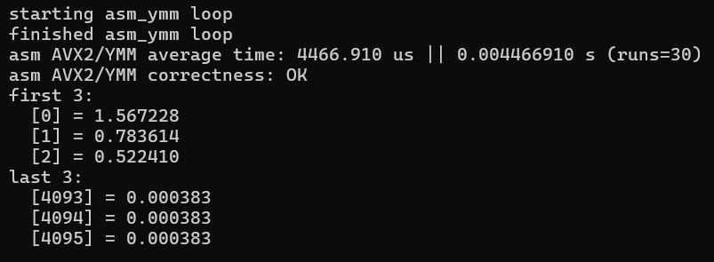

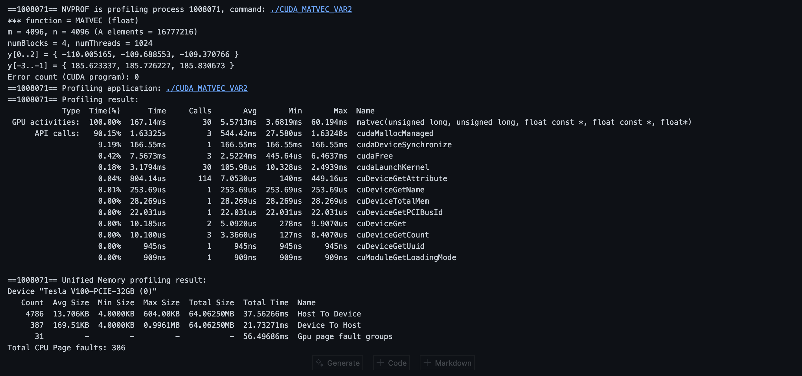
Caption: C baseline — correctness passed (L2 error = ...), wall-clock time = ... ms

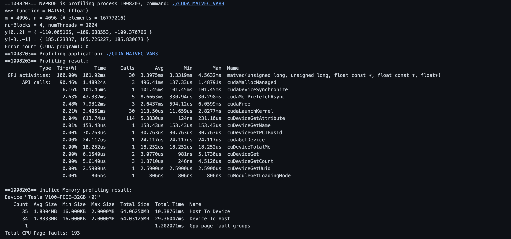
Caption: C baseline — correctness passed (L2 error = ...), wall-clock time = ... ms

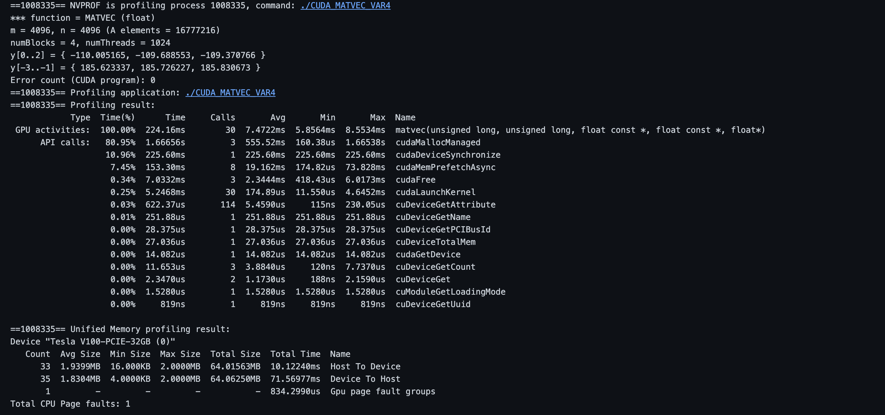
Caption: C baseline — correctness passed (L2 error = ...), wall-clock time = ... ms

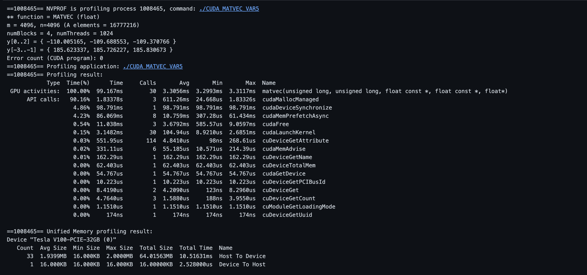
Caption: C baseline — correctness passed (L2 error = ...), wall-clock time = ... ms

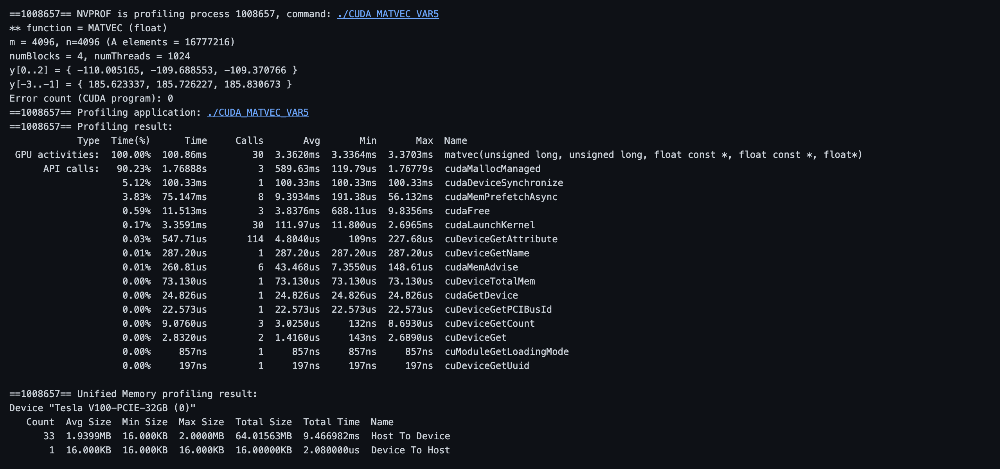
Caption: C baseline — correctness passed (L2 error = ...), wall-clock time = ... ms

## ii) nSight screenshots for CUDA variants

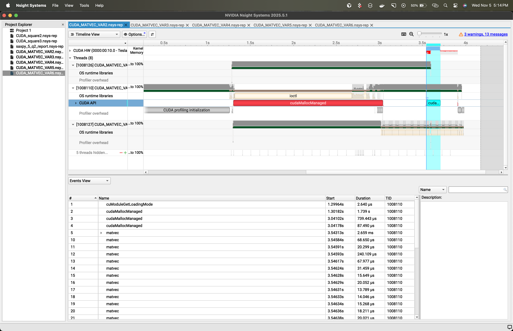
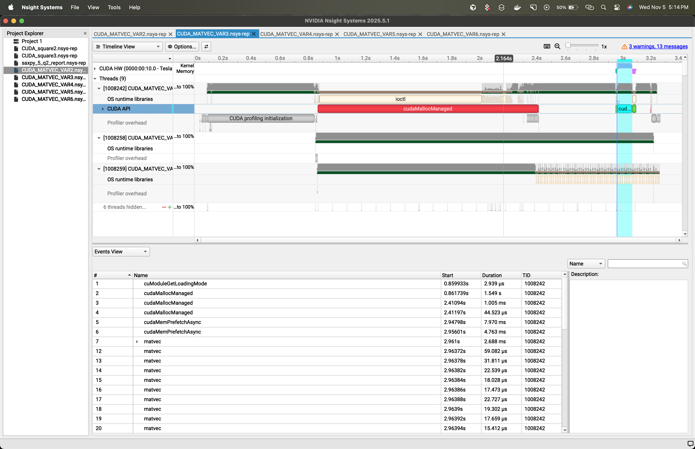
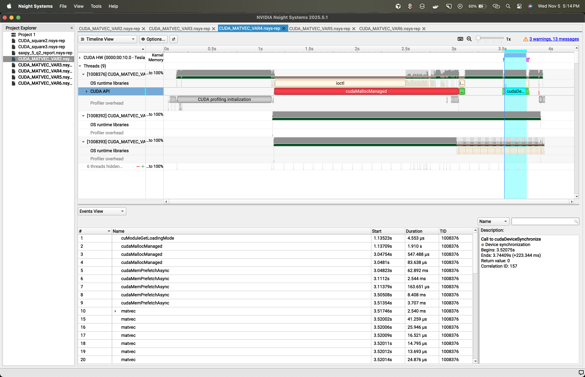
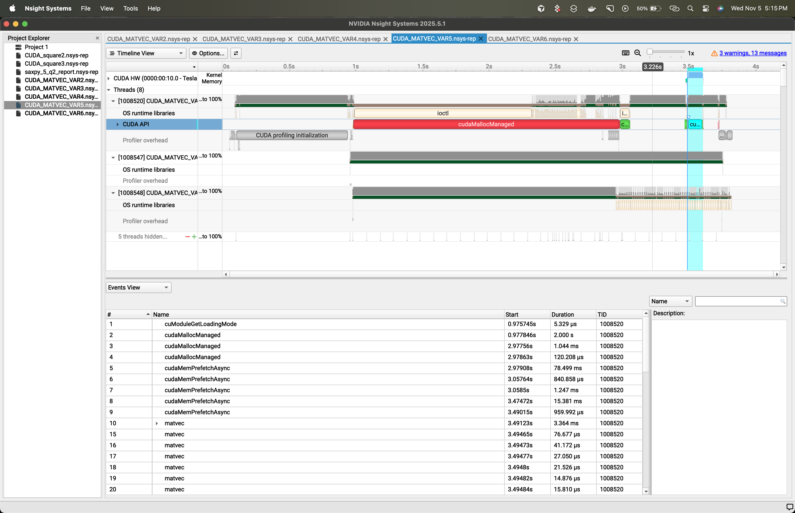
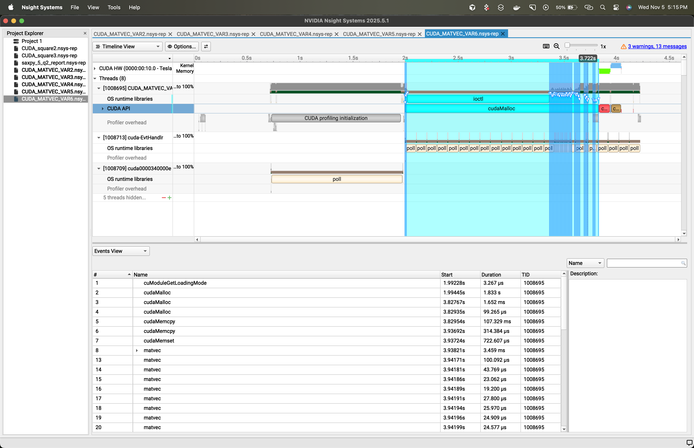

Embed example:

## iii) Comparative execution-time table

| Platform / Variant | Measured time (ms) | Speedup vs C |
|---|---:|---:|
| C baseline | 77.856500 | 1.00x |
| x86-64 scalar | 9.245687 | ____ |
| x86-64 SIMD XMM | 4.853967 | ____ |
| x86-64 SIMD YMM | 4.46691 | ____ |
| CUDA Unified | 64.86667 | ____ |
| CUDA Prefetch | 43.14558 | ____ |
| CUDA Prefetch + Page creation | 89.16437 | ____ |
| CUDA Prefetch + Page + memadvise | 13.824438 | ____ |
| CUDA classic memcpy | 12.831062 | ____ |
| CUDA data init in kernel | ____ | ____ |

## iv) Analysis of results

Provide concise, evidence-backed answers to the questions below and include any additional observations.

- Justify your kernel execution time.

- Analysis of speed performance across all platforms.

### Guide questions:
a) What overheads are included in the GPU execution time (up to the point data are transferred back for error checking)? Is it different for each CUDA variant?

b) How does block size affect execution time (observing various element counts and max blocks)? Which block size would you recommend and why?

c) Is prefetching always recommended, or should CUDA manage memory? Give specific use cases where prefetching helps or hurts.

d) Between SIMD and SIMT, which is faster for this workload? Give use cases where one model is preferable.

// add charts like bar charts for timings, speedup plots, and any roofline or bandwidth utilization graphs

## v) Problems encountered, solutions, and notable methodology

- Problems encountered:
	- problem - how found and fix

- Solutions and reasoning:
    - solution

- Unique methodology / AHA moments:
	- unique method
    aha

## vi) SIMD vs SIMT — conceptual comparison and project-specific pros/cons

analysis

## Final notes
notes
---

Last updated: November 5, 2025
